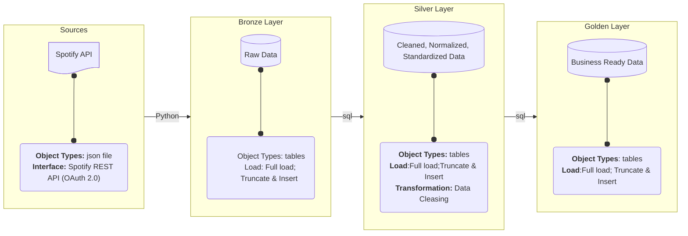

```mermaid
    flowchart LR
        subgraph rawdata [Sources]
            direction TB
            source1@{ shape: document, label: "Spotify API" }
            explanation1("`**Object Types:** json file<br>**Interface:** Spotify REST API (OAuth 2.0)`")
            source1 o---o explanation1
        end
        subgraph bronze_layer [Bronze Layer]
            direction TB
            bronze_data@{ shape: cyl, label: "Raw Data" }
            explanation_bronze("`<ul> Object Types: tables<br> Load: Full load; Truncate & Insert </ul> `")
            bronze_data o---o explanation_bronze
        end
        subgraph silver_layer [Silver Layer]
            direction TB
            silver_data@{ shape: cyl, label: "Cleaned, Normalized, Standardized Data"  }
            explanation_silver("`**Object Types:** tables<br>**Load**:Full load;Truncate & Insert<br>**Transformation:** Data Cleasing`")
            silver_data o---o explanation_silver
        end
        subgraph golden_layer [Golden Layer]
            direction TB
            golden_data@{ shape: cyl, label: "Business Ready Data"  }
            explanation_golden("`**Object Types**: tables<br>**Load**:Full load; Truncate & Insert`")
            golden_data o---o explanation_golden
        end

        rawdata -- Python --> bronze_layer
        bronze_layer -- sql --> silver_layer
        silver_layer -- sql --> golden_layer

        %% classDef explanation_style fill:green

```
